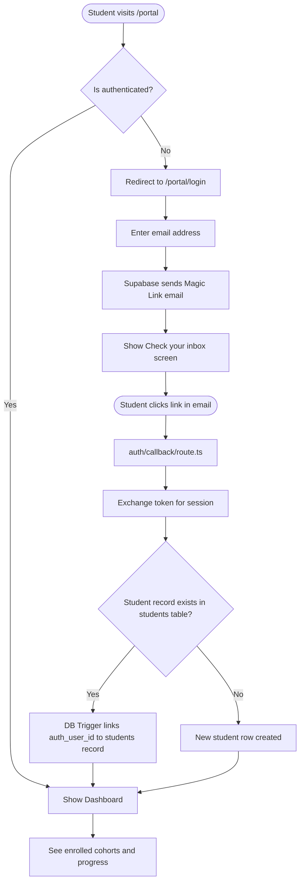
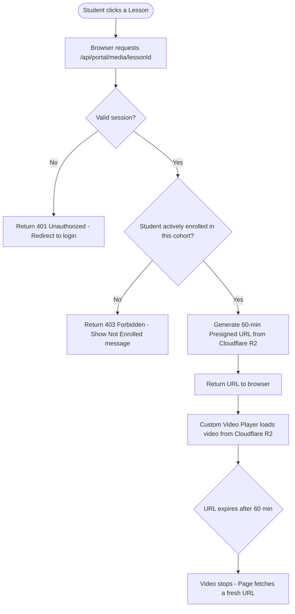
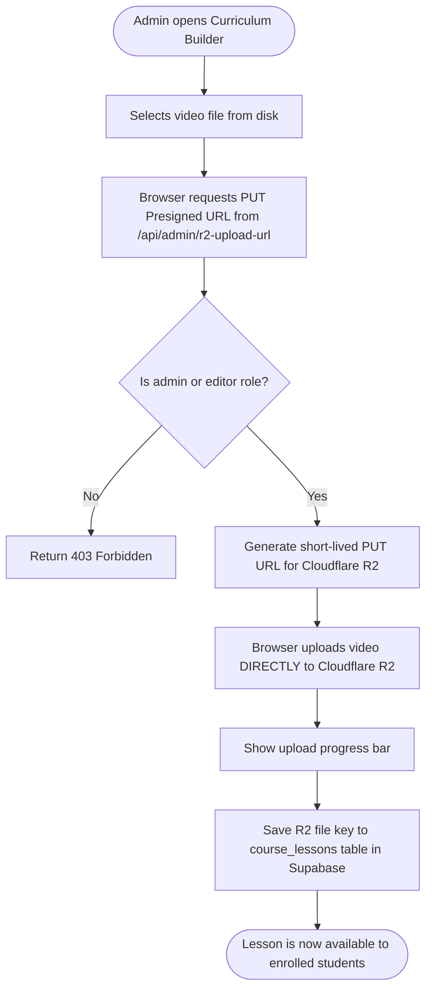

# Student Portal & Zero-Cost DRM Implementation Plan

This plan outlines the architecture for moving your courses out of Telegram and into a proprietary, secure, and **zero-cost** Student Portal built directly into this Next.js app. 

To achieve "Free DRM", we will utilize **Cloudflare R2** (which has zero egress fees) combined with **Presigned URLs** to prevent unauthorized sharing and downloading.

---

## User Flow Diagrams

### Flow A: Student Login (Magic Link Auth)



### Flow B: Student Watches a Lesson (DRM Presigned URL)



### Flow C: Admin Uploads a Video



---

## 1. Cloudflare R2 Integration (Zero-Cost Video Hosting)
Instead of paying for premium video hosting, we will use Cloudflare R2.
* **Private Bucket:** We will store all `.mp4` video lessons and `.pdf` notes in a private R2 bucket. They cannot be accessed publicly.
* **Presigned URLs (The DRM Layer):** When an enrolled student clicks "Play", our Next.js backend will verify their enrollment in the database and generate a temporary, expiring URL (valid for 60 minutes).
* **Prevention:** This prevents students from copying the video link and sending it to friends. The link will expire, and standard right-click "Save Video As" will be disabled on the frontend player.

## 2. Student Authentication (Magic Links)
Since your students currently don't have passwords, we will use **Passwordless Email Login (Magic Links)** via Supabase.
* **Login Flow:** A student goes to `/portal`, enters their email, and is shown a "Check your inbox" confirmation screen. They click the link in their email.
* **Auth Callback:** The magic link redirects to `app/auth/callback/route.ts` which exchanges the token for a session, then redirects to `/portal`.
* **Database Linkage:** A Supabase Database Trigger (`on_auth_user_created`) automatically links the new `auth.users` account to their historical `students` record by matching on email, so they instantly see their purchased cohorts.

## 3. Student Portal UI (`app/portal`)
We will create a beautiful, premium student dashboard.
* **`/portal`**: The main dashboard. Shows a grid of the courses/cohorts the student has paid for.
* **`/portal/[courseId]`**: The curriculum view. Shows the list of lessons, modules, and lesson progress tracking.
* **`/portal/[courseId]/lesson/[lessonId]`**: The secure learning room. Contains the custom secure video player and a `react-pdf` based PDF viewer.
* **`/portal/login`**: Magic Link request form + "Check your inbox" confirmation state.

## 4. Admin Content Management (`app/admin/courses`)
You need a way to easily upload these videos and organize the curriculum.
* **Upload System:** We will build a direct-to-R2 upload system in the admin dashboard. Large video files are uploaded directly from the browser to Cloudflare R2 without hitting the Next.js server.
* **Curriculum Builder:** An interface to create `courses` and attach `course_lessons` (videos/notes), setting their order and descriptions.

---

## Cloudflare Setup Instructions

You will need to configure Cloudflare R2 once before we begin. Here are the exact steps:

1. **Create Account:** Go to [dash.cloudflare.com](https://dash.cloudflare.com/sign-up) and sign up for a free account.
2. **Enable R2:** Click **R2 Object Storage** on the left sidebar. *(A credit card is required to prevent spam, but the free tier gives you 10GB storage and 10 Million reads/month at zero cost).*
3. **Create a Bucket:** Click **Create bucket**. Name it `veena-courses`. Leave location as "Automatic". Click Create.
4. **Get API Credentials:**
   * Go back to the main **R2 Object Storage** overview page.
   * Click **Manage R2 API Tokens** → **Create API token**.
   * Name it `Student Portal Admin` and grant **"Object Read & Write"** permissions.
   * Click Create. You will see your credentials — copy them all:
     * `Account ID` (visible in the URL and on the R2 overview page)
     * `Access Key ID`
     * `Secret Access Key`
     * `Bucket Name` (e.g., `veena-courses`)
5. **Configure CORS Policy (Required for Direct Uploads)**:
   * Select your bucket (`veena-courses`) and go to the **Settings** tab.
   * Scroll down to the **CORS Policy** section and click **Add CORS Policy**.
   * Paste the following JSON configuration to allow local development uploads:
     ```json
     [
       {
         "AllowedOrigins": [
           "http://localhost:3000",
           "https://vynika.org"
         ],
         "AllowedMethods": [
           "GET",
           "PUT",
           "HEAD"
         ],
         "AllowedHeaders": [
           "*"
         ],
         "ExposeHeaders": [],
         "MaxAgeSeconds": 3000
       }
     ]
     ```
   * Replace `https://vynika.org` with your actual production domain when deployed. Click **Save**.

> [!NOTE]
> **DNS Decision:** Since DNS is currently managed by Vercel, we will skip setting up a custom domain on Cloudflare. We will use the default secure internal R2 endpoint. Students never see raw URLs anyway since they are generated dynamically on each request.

---

## npm Dependencies to Install

Before building, we need to install one package:
```bash
npm install @aws-sdk/client-s3 @aws-sdk/s3-request-presigner react-pdf
```
* **`@aws-sdk/client-s3` + `@aws-sdk/s3-request-presigner`**: Used to generate secure presigned URLs for Cloudflare R2 (which uses an S3-compatible API).
* **`react-pdf`**: Used to render PDF lesson notes directly in the browser without allowing downloads.

---

## Proposed Changes

### Configuration

#### [MODIFY] `.env.local` & `.env.example`
Add the following Cloudflare R2 environment variables:
```
CLOUDFLARE_R2_ACCOUNT_ID=your_account_id
CLOUDFLARE_R2_ACCESS_KEY_ID=your_access_key_id
CLOUDFLARE_R2_SECRET_ACCESS_KEY=your_secret_access_key
CLOUDFLARE_R2_BUCKET_NAME=veena-courses
```

#### [MODIFY] `middleware.ts`
- Add `/portal` to the `WHITELISTED_PREFIXES` list so students can access the portal even when the site is in "coming soon" mode.

### Database

#### [NEW] `supabase/migrations/XXXXXX_portal_auth_trigger.sql`
- SQL trigger: `on_auth_user_created` — when a new student logs in via Magic Link, automatically finds their matching record in the `students` table by email and sets `auth_user_id`.
- Ensures students see their historical cohort data immediately on first login.

#### [NEW] `supabase/migrations/XXXXXX_lesson_progress.sql`
- New `lesson_progress` table to track which lessons a student has completed.
- Schema: `(id, student_id, lesson_id, completed_at, last_watched_seconds)`.
- RLS policies: students can only read/write their own progress.

### Authentication & Portal

#### [NEW] `app/auth/callback/route.ts`
- The magic link callback handler. Exchanges the Supabase OTP token for a session and redirects the user to `/portal`.

#### [NEW] `app/portal/layout.tsx`
- Server component that checks if the user is authenticated. Redirects unauthenticated users to `/portal/login`.

#### [NEW] `app/portal/login/page.tsx`
- Email input form to request a Magic Link.
- Shows a "Check your inbox ✉️" confirmation screen after submission.

#### [NEW] `app/portal/page.tsx`
- Student dashboard showing enrolled cohorts as course cards with progress indicators.

#### [NEW] `app/portal/[courseId]/page.tsx`
- Course curriculum view: lesson list grouped by module, with completed/locked states.

#### [NEW] `app/portal/[courseId]/lesson/[lessonId]/page.tsx`
- The secure learning room.
- Custom video player (no download button, no right-click).
- `react-pdf` viewer for PDF notes (download disabled).
- Marks lesson as complete on finish.

#### [NEW] `app/api/portal/media/[lessonId]/route.ts`
- Protected API endpoint.
- Validates the student's session and active enrollment in the cohort containing this lesson.
- Returns a 60-minute presigned Cloudflare R2 URL for the video/PDF.
- Returns `403 Forbidden` if the student is not enrolled.

### Admin Course Management

#### [NEW] `app/admin/courses/page.tsx`
- Admin dashboard listing all courses, linked cohorts, and lesson counts.

#### [NEW] `app/admin/courses/[courseId]/page.tsx`
- Curriculum builder: drag-to-reorder lessons, edit titles/descriptions, toggle free preview.
- Direct-to-R2 video uploader with progress bar.

#### [NEW] `app/api/admin/r2-upload-url/route.ts`
- Admin-only endpoint (checks for `admin` or `editor` role).
- Generates a short-lived PUT presigned URL so the browser can upload large files directly to R2.

---

## Verification Plan

1. Run `npm install` to confirm new dependencies resolve cleanly.
2. Run the new SQL migration scripts on the Supabase database.
3. Create a mock test student in the `students` table matching a real email address.
4. Navigate to `/portal/login`, enter the email, and click the Magic Link.
5. Verify the auth callback correctly links the session to the student record.
6. Confirm enrolled cohorts are visible on the `/portal` dashboard.
7. Play a lesson video and confirm the presigned URL works.
8. Copy the video URL and open it in a new incognito window — confirm it works for 60 minutes but fails after expiry.
9. As admin, upload a test video file via `/admin/courses` and confirm it appears in R2.
10. Verify the `/portal` route is accessible when the site is in "coming soon" mode.
