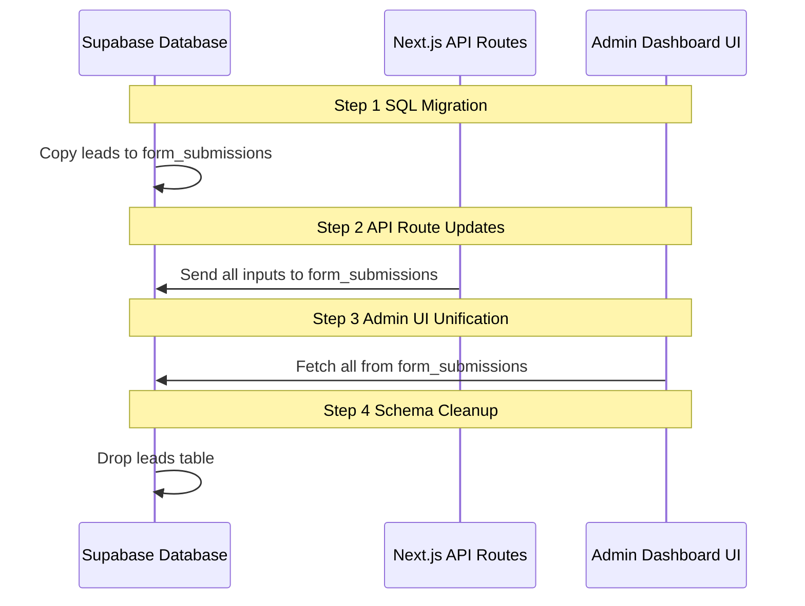
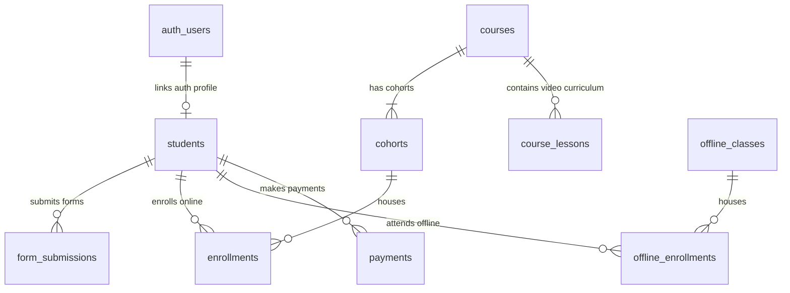

# Database Evolution & Student Portal Architecture Plan

This document provides a unified architecture plan to optimize your database schema in two steps:
1. **Consolidate `leads` and `form_submissions`** to eliminate table and page redundancy.
2. **Future-proof the schema for Student Logins and Offline Classes**, supporting student overlap and securing cohort videos.

---

## Part 1: Leads and Form Submissions Consolidation

### A. Current Schema Limitations
Currently, inquiries for classes, performances, and collaborations are saved in `leads`, while registrations and payments are saved in `form_submissions`. 
* **Redundancy:** Both tables store the same shape of data (names, emails, phones, and dynamic JSON form fields).
* **UI/UX Bloat:** The admin dashboard has two separate pages (`/admin/leads` and `/admin/responses`) that use nearly identical code.
* **API Branching:** Next.js has to run check logic in `/api/send-email` to route submissions to the correct table.

### B. Consolidation Plan



#### Workflow Steps (Text Alternative)
1. **Step 1: SQL Migration** $\rightarrow$ Database moves all records in the `leads` table to `form_submissions`, mapping statuses.
2. **Step 2: API Route Updates** $\rightarrow$ The contact forms backend API (`/api/send-email`) is refactored to write directly to `form_submissions`.
3. **Step 3: Admin UI Unification** $\rightarrow$ The admin panel frontend displays consolidated records under a single submissions view.
4. **Step 4: Schema Cleanup** $\rightarrow$ Database administrator drops the legacy `leads` table.

#### 1. SQL Migration (Data Backfill)
We migrate existing data from `leads` into `form_submissions`. To ensure consistency and keep things simple, we map lead status directly to the standard `form_submissions` read states (`unread`, `read`, `archived`):
* `new` status maps to `unread`.
* `archived` status maps to `archived`.
* `contacted` and `converted` statuses map to `read`.

```sql
INSERT INTO public.form_submissions (
    form_slug,
    form_data,
    user_name,
    user_email,
    status,
    cohort_id,
    is_verified,
    payment_status,
    created_at,
    updated_at
)
SELECT 
    COALESCE(form_slug, inquiry_type, 'general') AS form_slug,
    COALESCE(form_data, json_build_object('message', message)) AS form_data,
    COALESCE(name, 'Anonymous') AS user_name,
    email AS user_email,
    CASE 
        WHEN status = 'new' THEN 'unread'
        WHEN status = 'archived' THEN 'archived'
        ELSE 'read'
    END AS status,
    cohort_id,
    is_verified,
    'none' AS payment_status,
    created_at,
    updated_at
FROM 
    public.leads;
```

#### 2. Next.js API Refactor
We simplify `app/api/send-email/route.ts` to target `form_submissions` exclusively, removing the fork:
```diff
-    const leadSlugs = ['performance', 'collaboration', 'classes'];
-    const targetTable = leadSlugs.includes(formSlug) ? 'leads' : 'form_submissions';
+    const targetTable = 'form_submissions';
```

#### 3. Dashboard Consolidation
* Combine the React tables in `/admin/responses` and `/admin/leads` into a single unified screen.
* Add filter tabs for "All", "Classes", "Performance", and "Paid Cohorts".
* Set up a Next.js rewrite or redirect in `next.config.js` to point `/admin/leads` to `/admin/responses?form=classes`.

#### 4. Drop the `leads` Table
After deploying the code, execute the clean-up migration:
```sql
DROP TABLE IF EXISTS public.leads;
```

### C. Code references to update (Leads Consolidation)
The following files query the `leads` table and must be updated to query `form_submissions` filtering by `form_slug` where relevant:

1. **`app/admin/analytics/page.tsx`**
   * Change: `.from('leads')` $\rightarrow$ `.from('form_submissions')` (under cohort engagement calculations).
2. **`app/admin/AdminLayoutClient.tsx`**
   * Change: Update the counter badges that fetch unread leads from the `leads` table to query `form_submissions` where `form_slug IN ('classes', 'performance', 'collaboration')`.
3. **`components/admin/CohortManager.tsx`**
   * Change: Update database select queries counting cohort leads to query `form_submissions` instead of `leads`.
4. **`app/admin/leads/page.tsx`**
   * Change: Merge the dynamic layout views from here directly into `/admin/responses` or delete once dashboard consolidation is complete.

---

## Part 2: Future-proofing the Database (Students, Offline Classes & Videos)

Once the logs are consolidated, we normalize the database structure to prepare for user portals, secure videos, and offline students.

### A. Current Structure vs. Normalized Model
Currently, `form_submissions` holds both dynamic form data and customer checkout records. `cohorts` couples static course details with batch running details.
To support future features, we separate these concerns:
* **`students`**: Centralizes student contact info and binds them to a single Supabase login ID.
* **`enrollments`**: Connects a student to an active **online cohort**.
* **`offline_enrollments`**: Connects a student to an active **offline class**.
* **`payments`**: Isolates financial/payment records.
* **`courses` & `course_lessons`**: Isolates static videos and curriculum structures from specific run dates.

### B. Normalized Relationship Schema



#### Database Relationships (Text Alternative)

| Primary Table | Cardinality / Relation | Related Table | Foreign Key / Description |
|---|---|---|---|
| `auth.users` | `1 : 0..1` (One-to-Optional-One) | `students` | Links portal credentials to profile via `students.auth_user_id` |
| `students` | `1 : 0..*` (One-to-Many) | `form_submissions` | Stores client contact inputs by reference |
| `students` | `1 : 0..*` (One-to-Many) | `enrollments` | Links students to online classes via `enrollments.student_id` |
| `students` | `1 : 0..*` (One-to-Many) | `offline_enrollments` | Links students to offline classes via `offline_enrollments.student_id` |
| `students` | `1 : 0..*` (One-to-Many) | `payments` | Tracks student purchase logs via `payments.student_id` |
| `courses` | `1 : 1..*` (One-to-Many-Required) | `cohorts` | Connects course material to run dates via `cohorts.course_id` |
| `courses` | `1 : 0..*` (One-to-Many) | `course_lessons` | Defines video lesson index via `course_lessons.course_id` |
| `cohorts` | `1 : 0..*` (One-to-Many) | `enrollments` | Houses online students via `enrollments.cohort_id` |
| `offline_classes` | `1 : 0..*` (One-to-Many) | `offline_enrollments` | Houses offline students via `offline_enrollments.offline_class_id` |

### C. SQL Definitions for Normalized Schema

```sql
-- 1. COURSES TABLE
CREATE TABLE IF NOT EXISTS public.courses (
    id UUID DEFAULT gen_random_uuid() PRIMARY KEY,
    title TEXT NOT NULL,
    description TEXT,
    image_url TEXT,
    created_at TIMESTAMPTZ DEFAULT NOW(),
    updated_at TIMESTAMPTZ DEFAULT NOW()
);

-- 1b. COURSE LESSONS TABLE
CREATE TABLE IF NOT EXISTS public.course_lessons (
    id UUID DEFAULT gen_random_uuid() PRIMARY KEY,
    course_id UUID NOT NULL REFERENCES public.courses(id) ON DELETE CASCADE,
    title TEXT NOT NULL,
    description TEXT,
    video_url TEXT, -- Secure URL (Vimeo, YouTube, Cloudinary, etc.)
    video_duration INTEGER, -- in seconds
    is_free_preview BOOLEAN DEFAULT false,
    order_index INTEGER DEFAULT 0,
    created_at TIMESTAMPTZ DEFAULT NOW()
);

-- 2. LINK COHORTS TO COURSES
ALTER TABLE public.cohorts ADD COLUMN IF NOT EXISTS course_id UUID REFERENCES public.courses(id);

-- 3. STUDENTS TABLE (Central Identity)
CREATE TABLE IF NOT EXISTS public.students (
    id UUID DEFAULT gen_random_uuid() PRIMARY KEY,
    auth_user_id UUID UNIQUE, -- Populated once student sets up their portal password
    name TEXT NOT NULL,
    email TEXT UNIQUE NOT NULL,
    phone TEXT,
    created_at TIMESTAMPTZ DEFAULT NOW(),
    updated_at TIMESTAMPTZ DEFAULT NOW()
);

-- 4. ONLINE ENROLLMENTS TABLE
CREATE TABLE IF NOT EXISTS public.enrollments (
    id UUID DEFAULT gen_random_uuid() PRIMARY KEY,
    student_id UUID NOT NULL REFERENCES public.students(id) ON DELETE CASCADE,
    cohort_id UUID NOT NULL REFERENCES public.cohorts(id) ON DELETE RESTRICT,
    status TEXT DEFAULT 'active' CHECK (status IN ('active', 'completed', 'cancelled')),
    telegram_joined BOOLEAN DEFAULT false,
    telegram_username TEXT,
    telegram_invite_link TEXT,
    created_at TIMESTAMPTZ DEFAULT NOW(),
    UNIQUE(student_id, cohort_id)
);

-- 5. OFFLINE CLASSES TABLE
CREATE TABLE IF NOT EXISTS public.offline_classes (
    id UUID DEFAULT gen_random_uuid() PRIMARY KEY,
    title TEXT NOT NULL, -- e.g., "Weekend Vocal Basic"
    description TEXT,
    fees_monthly INTEGER NOT NULL, -- in paise
    is_active BOOLEAN DEFAULT true,
    created_at TIMESTAMPTZ DEFAULT NOW()
);

-- 6. OFFLINE ENROLLMENTS TABLE
CREATE TABLE IF NOT EXISTS public.offline_enrollments (
    id UUID DEFAULT gen_random_uuid() PRIMARY KEY,
    student_id UUID NOT NULL REFERENCES public.students(id) ON DELETE CASCADE,
    offline_class_id UUID NOT NULL REFERENCES public.offline_classes(id) ON DELETE RESTRICT,
    status TEXT DEFAULT 'active' CHECK (status IN ('active', 'paused', 'completed', 'cancelled')),
    joined_date DATE NOT NULL DEFAULT CURRENT_DATE,
    remarks TEXT,
    created_at TIMESTAMPTZ DEFAULT NOW(),
    UNIQUE(student_id, offline_class_id)
);

-- 7. PAYMENTS TABLE
CREATE TABLE IF NOT EXISTS public.payments (
    id UUID DEFAULT gen_random_uuid() PRIMARY KEY,
    student_id UUID REFERENCES public.students(id) ON DELETE SET NULL,
    enrollment_id UUID REFERENCES public.enrollments(id) ON DELETE SET NULL,
    razorpay_order_id TEXT UNIQUE,
    razorpay_payment_id TEXT UNIQUE,
    razorpay_payment_link_id TEXT UNIQUE,
    razorpay_subscription_id TEXT UNIQUE,
    razorpay_customer_id TEXT,
    amount INTEGER, -- in paise
    status TEXT DEFAULT 'pending' CHECK (status IN ('pending', 'paid', 'failed', 'refunded')),
    created_at TIMESTAMPTZ DEFAULT NOW(),
    updated_at TIMESTAMPTZ DEFAULT NOW()
);

-- 8. REENROLLMENT INVITATIONS TABLE (Normalized from reenrollment_logs)
CREATE TABLE IF NOT EXISTS public.reenrollment_invitations (
    id UUID DEFAULT gen_random_uuid() PRIMARY KEY,
    student_id UUID NOT NULL REFERENCES public.students(id) ON DELETE CASCADE,
    source_cohort_id UUID REFERENCES public.cohorts(id) ON DELETE SET NULL,
    target_cohort_id UUID NOT NULL REFERENCES public.cohorts(id) ON DELETE CASCADE,
    payment_link_id TEXT,
    payment_link_url TEXT,
    status TEXT DEFAULT 'pending' CHECK (status IN ('pending', 'sent', 'failed', 'paid')),
    error_message TEXT,
    created_at TIMESTAMPTZ DEFAULT NOW(),
    updated_at TIMESTAMPTZ DEFAULT NOW()
);

-- 9. NORMALIZE TELEGRAM INVITE LOGS RELATION
-- We add an enrollment_id foreign key so Telegram activity tracks against student enrollments rather than dynamic forms.
ALTER TABLE public.telegram_invite_logs ADD COLUMN IF NOT EXISTS enrollment_id UUID REFERENCES public.enrollments(id) ON DELETE CASCADE;
```

### D. Rebuilding the Unified Search View
The admin portal queries `student_search_view` to show a unified list of cohort checkouts and sent invites. We drop and rebuild the view to run against the normalized database structure:

```sql
CREATE OR REPLACE VIEW public.student_search_view 
WITH (security_invoker = on) AS
SELECT 
    e.id,
    s.name,
    s.email,
    COALESCE(s.phone, '') AS phone,
    c.title AS cohort_title,
    'enrollment'::text AS type,
    CASE WHEN e.status = 'active' THEN 'paid'::text ELSE 'pending'::text END AS status,
    e.created_at,
    e.telegram_invite_link AS payment_link_url,
    e.telegram_joined,
    e.telegram_username,
    (SELECT p.amount FROM public.payments p WHERE p.enrollment_id = e.id AND p.status = 'paid' LIMIT 1) AS amount
FROM 
    public.enrollments e
    JOIN public.students s ON e.student_id = s.id
    JOIN public.cohorts c ON e.cohort_id = c.id
UNION ALL
SELECT 
    ri.id,
    s.name,
    s.email,
    COALESCE(s.phone, '') AS phone,
    c.title AS cohort_title,
    'invitation'::text AS type,
    ri.status AS status,
    ri.created_at,
    ri.payment_link_url,
    false AS telegram_joined,
    NULL::text AS telegram_username,
    NULL::integer AS amount
FROM 
    public.reenrollment_invitations ri
    JOIN public.students s ON ri.student_id = s.id
    JOIN public.cohorts c ON ri.target_cohort_id = c.id;
```

### E. Code references to update (Reenrollment Normalization)
The following files query the old `reenrollment_logs` table and must be updated to target `reenrollment_invitations`:

1. **`app/api/webhooks/razorpay/route.ts`**
   * Change: `.from('reenrollment_logs')` $\rightarrow$ `.from('reenrollment_invitations')` (when marking reenrollment checkout invites as paid).
2. **`app/api/admin/cohorts/reenroll/route.ts`**
   * Change: Update all queries creating or searching invitation records to use `reenrollment_invitations`.
3. **`components/admin/CohortManager.tsx`**
   * Change: Update references in cohort table screens that show sent invitation lists to load from `reenrollment_invitations`.

---

## Part 3: Architecture Safeguards

To address database integrity, race conditions, and query performance, we build essential safeguards directly into the database architecture:

### 1. Database Indexing (Query Performance Optimization)
To guarantee page loading speeds remain fast when querying relational data, we apply explicit indexes to all key search, lookup, and join paths:

```sql
-- Student Profile Lookups
CREATE INDEX IF NOT EXISTS idx_students_email ON public.students(email);
CREATE INDEX IF NOT EXISTS idx_students_auth_user_id ON public.students(auth_user_id);

-- Enrollment and Cohort Joins
CREATE INDEX IF NOT EXISTS idx_enrollments_student_id ON public.enrollments(student_id);
CREATE INDEX IF NOT EXISTS idx_enrollments_cohort_id ON public.enrollments(cohort_id);

-- Offline Class Joins
CREATE INDEX IF NOT EXISTS idx_offline_enrollments_student_id ON public.offline_enrollments(student_id);
CREATE INDEX IF NOT EXISTS idx_offline_enrollments_class_id ON public.offline_enrollments(offline_class_id);

-- Payment Joins & Verification Checks
CREATE INDEX IF NOT EXISTS idx_payments_student_id ON public.payments(student_id);
CREATE INDEX IF NOT EXISTS idx_payments_enrollment_id ON public.payments(enrollment_id);
CREATE INDEX IF NOT EXISTS idx_payments_order_id ON public.payments(razorpay_order_id);
CREATE INDEX IF NOT EXISTS idx_payments_payment_id ON public.payments(razorpay_payment_id);

-- Reenrollment Invitation Lookups
CREATE INDEX IF NOT EXISTS idx_reenrollment_invitations_student_id ON public.reenrollment_invitations(student_id);
CREATE INDEX IF NOT EXISTS idx_reenrollment_invitations_target ON public.reenrollment_invitations(target_cohort_id);

-- Telegram Invite Logs Lookups
CREATE INDEX IF NOT EXISTS idx_telegram_invite_logs_enrollment_id ON public.telegram_invite_logs(enrollment_id);
```

### 2. Row Level Security (RLS) Policies
To protect student and payment records from malicious access while keeping content public, we define explicit RLS rules:

```sql
-- A. Students Profiles
ALTER TABLE public.students ENABLE ROW LEVEL SECURITY;

CREATE POLICY "Students can read their own profile" ON public.students
    FOR SELECT TO authenticated USING (auth.uid() = auth_user_id);

CREATE POLICY "Admins/editors can manage all student profiles" ON public.students
    FOR ALL TO authenticated USING (
        EXISTS (SELECT 1 FROM public.profiles WHERE id = auth.uid() AND (role = 'admin' OR role = 'editor'))
    );

-- B. Enrollments
ALTER TABLE public.enrollments ENABLE ROW LEVEL SECURITY;

CREATE POLICY "Students can view their own enrollments" ON public.enrollments
    FOR SELECT TO authenticated USING (
        student_id IN (SELECT id FROM public.students WHERE auth_user_id = auth.uid())
    );

CREATE POLICY "Admins/editors can manage all enrollments" ON public.enrollments
    FOR ALL TO authenticated USING (
        EXISTS (SELECT 1 FROM public.profiles WHERE id = auth.uid() AND (role = 'admin' OR role = 'editor'))
    );

-- C. Payments
ALTER TABLE public.payments ENABLE ROW LEVEL SECURITY;

CREATE POLICY "Students can view their own payments" ON public.payments
    FOR SELECT TO authenticated USING (
        student_id IN (SELECT id FROM public.students WHERE auth_user_id = auth.uid())
    );

CREATE POLICY "Admins/editors can manage all payments" ON public.payments
    FOR ALL TO authenticated USING (
        EXISTS (SELECT 1 FROM public.profiles WHERE id = auth.uid() AND (role = 'admin' OR role = 'editor'))
    );

-- D. Reenrollment Invitations
ALTER TABLE public.reenrollment_invitations ENABLE ROW LEVEL SECURITY;

CREATE POLICY "Students can view their own invitations" ON public.reenrollment_invitations
    FOR SELECT TO authenticated USING (
        student_id IN (SELECT id FROM public.students WHERE auth_user_id = auth.uid())
    );

CREATE POLICY "Admins/editors can manage invitations" ON public.reenrollment_invitations
    FOR ALL TO authenticated USING (
        EXISTS (SELECT 1 FROM public.profiles WHERE id = auth.uid() AND (role = 'admin' OR role = 'editor'))
    );

-- E. Courses & Lessons
ALTER TABLE public.courses ENABLE ROW LEVEL SECURITY;
ALTER TABLE public.course_lessons ENABLE ROW LEVEL SECURITY;

CREATE POLICY "Allow public read access to published courses" ON public.courses
    FOR SELECT USING (true);

CREATE POLICY "Allow select for verified lesson access" ON public.course_lessons
    FOR SELECT TO authenticated USING (
        is_free_preview = true OR verify_lesson_access(auth.uid(), id)
    );

CREATE POLICY "Admins/editors can manage courses" ON public.courses
    FOR ALL TO authenticated USING (
        EXISTS (SELECT 1 FROM public.profiles WHERE id = auth.uid() AND (role = 'admin' OR role = 'editor'))
    );

CREATE POLICY "Admins/editors can manage lessons" ON public.course_lessons
    FOR ALL TO authenticated USING (
        EXISTS (SELECT 1 FROM public.profiles WHERE id = auth.uid() AND (role = 'admin' OR role = 'editor'))
    );

-- F. Offline System
ALTER TABLE public.offline_classes ENABLE ROW LEVEL SECURITY;
ALTER TABLE public.offline_enrollments ENABLE ROW LEVEL SECURITY;

CREATE POLICY "Students can view their own offline enrollments" ON public.offline_enrollments
    FOR SELECT TO authenticated USING (
        student_id IN (SELECT id FROM public.students WHERE auth_user_id = auth.uid())
    );

CREATE POLICY "Students can view offline classes they are enrolled in" ON public.offline_classes
    FOR SELECT TO authenticated USING (
        EXISTS (
            SELECT 1 FROM public.offline_enrollments oe
            JOIN public.students s ON oe.student_id = s.id
            WHERE oe.offline_class_id = id
              AND s.auth_user_id = auth.uid()
        )
    );

CREATE POLICY "Admins/editors can manage offline classes" ON public.offline_classes
    FOR ALL TO authenticated USING (
        EXISTS (SELECT 1 FROM public.profiles WHERE id = auth.uid() AND (role = 'admin' OR role = 'editor'))
    );
    
CREATE POLICY "Admins/editors can manage offline enrollments" ON public.offline_enrollments
    FOR ALL TO authenticated USING (
        EXISTS (SELECT 1 FROM public.profiles WHERE id = auth.uid() AND (role = 'admin' OR role = 'editor'))
    );
```

### 3. PostgreSQL Auto-Timestamp Triggers
We bind the existing `update_updated_at_column()` database trigger to all new tables to ensure that updates automatically refresh timestamps at the storage engine level:

```sql
CREATE TRIGGER update_students_updated_at 
    BEFORE UPDATE ON public.students 
    FOR EACH ROW EXECUTE FUNCTION update_updated_at_column();

CREATE TRIGGER update_enrollments_updated_at 
    BEFORE UPDATE ON public.enrollments 
    FOR EACH ROW EXECUTE FUNCTION update_updated_at_column();

CREATE TRIGGER update_offline_enrollments_updated_at 
    BEFORE UPDATE ON public.offline_enrollments 
    FOR EACH ROW EXECUTE FUNCTION update_updated_at_column();

CREATE TRIGGER update_payments_updated_at 
    BEFORE UPDATE ON public.payments 
    FOR EACH ROW EXECUTE FUNCTION update_updated_at_column();

CREATE TRIGGER update_reenrollment_invitations_updated_at 
    BEFORE UPDATE ON public.reenrollment_invitations 
    FOR EACH ROW EXECUTE FUNCTION update_updated_at_column();
```

### 4. Transaction-Safe Data Migration (Backfill SQL)
To migrate data cleanly from `form_submissions` and `reenrollment_logs` to the relational tables without risk of incomplete writes, the script is wrapped in a single database transaction (`BEGIN; ... COMMIT;`). If any part of the query fails, all updates roll back, ensuring database consistency.

```sql
BEGIN;

-- A. Backfill unique students from form_submissions (mapped by email)
INSERT INTO public.students (name, email, phone, created_at, updated_at)
SELECT DISTINCT ON (user_email)
    COALESCE(user_name, 'Anonymous') AS name,
    user_email AS email,
    COALESCE(form_data->>'phone', '') AS phone,
    created_at,
    updated_at
FROM public.form_submissions
WHERE user_email IS NOT NULL AND cohort_id IS NOT NULL
ORDER BY user_email, created_at DESC
ON CONFLICT (email) DO UPDATE SET
    phone = CASE WHEN COALESCE(EXCLUDED.phone, '') <> '' THEN EXCLUDED.phone ELSE students.phone END,
    updated_at = NOW();

-- B. Backfill unique students from reenrollment_logs (that aren't already created)
INSERT INTO public.students (name, email, phone, created_at, updated_at)
SELECT DISTINCT ON (student_email)
    student_name AS name,
    student_email AS email,
    student_phone AS phone,
    created_at,
    updated_at
FROM public.reenrollment_logs
WHERE student_email IS NOT NULL
ORDER BY student_email, created_at DESC
ON CONFLICT (email) DO NOTHING;

-- C. Backfill enrollments linking the student to their cohort
INSERT INTO public.enrollments (student_id, cohort_id, status, telegram_joined, telegram_username, telegram_invite_link, created_at)
SELECT DISTINCT ON (s.id, fs.cohort_id)
    s.id AS student_id,
    fs.cohort_id,
    CASE WHEN fs.payment_status = 'paid' THEN 'active'::text ELSE 'cancelled'::text END AS status,
    COALESCE(fs.telegram_joined, false) AS telegram_joined,
    fs.telegram_username,
    fs.telegram_invite_link,
    fs.created_at
FROM public.form_submissions fs
JOIN public.students s ON fs.user_email = s.email
WHERE fs.cohort_id IS NOT NULL
ORDER BY s.id, fs.cohort_id, fs.created_at DESC
ON CONFLICT (student_id, cohort_id) DO UPDATE SET
    status = EXCLUDED.status,
    telegram_joined = EXCLUDED.telegram_joined,
    telegram_username = EXCLUDED.telegram_username,
    telegram_invite_link = EXCLUDED.telegram_invite_link;

-- D. Backfill payments linking transactions to the student and enrollment
INSERT INTO public.payments (
    student_id, 
    enrollment_id, 
    razorpay_order_id, 
    razorpay_payment_id, 
    razorpay_payment_link_id, 
    razorpay_subscription_id, 
    razorpay_customer_id, 
    amount, 
    status, 
    created_at
)
SELECT 
    s.id AS student_id,
    e.id AS enrollment_id,
    fs.razorpay_order_id,
    fs.razorpay_payment_id,
    fs.razorpay_payment_link_id,
    fs.razorpay_subscription_id,
    fs.razorpay_customer_id,
    fs.razorpay_amount AS amount,
    CASE WHEN fs.payment_status = 'paid' THEN 'paid'::text ELSE 'pending'::text END AS status,
    fs.created_at
FROM public.form_submissions fs
JOIN public.students s ON fs.user_email = s.email
LEFT JOIN public.enrollments e ON e.student_id = s.id AND e.cohort_id = fs.cohort_id
WHERE fs.cohort_id IS NOT NULL AND (
    fs.razorpay_order_id IS NOT NULL 
    OR fs.razorpay_payment_id IS NOT NULL 
    OR fs.razorpay_payment_link_id IS NOT NULL 
    OR fs.razorpay_subscription_id IS NOT NULL
)
ON CONFLICT (razorpay_payment_id) DO NOTHING;

-- E. Backfill reenrollment invitations from old logs
INSERT INTO public.reenrollment_invitations (student_id, source_cohort_id, target_cohort_id, payment_link_id, payment_link_url, status, error_message, created_at, updated_at)
SELECT
    s.id AS student_id,
    rl.source_cohort_id,
    rl.target_cohort_id,
    rl.payment_link_id,
    rl.payment_link_url,
    rl.status,
    rl.error_message,
    rl.created_at,
    rl.updated_at
FROM public.reenrollment_logs rl
JOIN public.students s ON rl.student_email = s.email;

-- F. Migrate telegram_invite_logs reference to enrollment_id
UPDATE public.telegram_invite_logs til
SET enrollment_id = e.id
FROM public.form_submissions fs
JOIN public.students s ON fs.user_email = s.email
JOIN public.enrollments e ON e.student_id = s.id AND e.cohort_id = fs.cohort_id
WHERE til.submission_id = fs.id AND til.enrollment_id IS NULL;

COMMIT;
```

### 5. Webhook Race Condition Mitigation (API Upsert Design)
When external checkout endpoints (Razorpay/Resend) process submissions asynchronously, they must be idempotent to prevent race conditions (e.g. creating duplicate student records for concurrent payment hits).
* **DB-Level Guard:** The unique indexes `UNIQUE(student_id, cohort_id)` on `enrollments` and `UNIQUE(email)` on `students` protect the tables from duplicates.
* **API Upsert Guard:** In the webhook routes, the insertion uses Supabase `.upsert()` with `onConflict` clauses to handle sequential updates safely.

*Upsert logic example for Next.js webhooks:*
```typescript
// 1. Create or retrieve the student profile
const { data: student } = await supabaseAdmin
  .from('students')
  .upsert({ email, name, phone }, { onConflict: 'email' })
  .select()
  .single();

// 2. Link student to cohort enrollment
const { data: enrollment } = await supabaseAdmin
  .from('enrollments')
  .upsert(
    { student_id: student.id, cohort_id: cohortId, status: 'active' }, 
    { onConflict: 'student_id,cohort_id' }
  )
  .select()
  .single();

// 3. Record payment log
await supabaseAdmin
  .from('payments')
  .upsert(
    {
      student_id: student.id,
      enrollment_id: enrollment.id,
      razorpay_order_id: orderId,
      razorpay_payment_id: paymentId,
      amount: amount,
      status: 'paid'
    },
    { onConflict: 'razorpay_order_id' }
  );
```

---

## Part 4: Access Control & Overlaps

### A. Protecting Cohort Videos (On-Site Only)
1. **Video Streaming Protection:** Host videos on Vimeo using **domain restriction** (denying playback outside `veenamanikarnike.com`), or generate short-lived signed URLs via Mux.
2. **Access Control Check:** Next.js Server Components check credentials against a secure database function before serving the video stream:

```sql
CREATE OR REPLACE FUNCTION verify_lesson_access(p_user_id UUID, p_lesson_id UUID)
RETURNS BOOLEAN AS $$
BEGIN
    -- Allow admins and editors bypass
    IF EXISTS (SELECT 1 FROM profiles WHERE id = p_user_id AND (role = 'admin' OR role = 'editor')) THEN
        RETURN true;
    END IF;

    -- Allow access if lesson is a free preview
    IF EXISTS (SELECT 1 FROM course_lessons WHERE id = p_lesson_id AND is_free_preview = true) THEN
        RETURN true;
    END IF;

    -- Allow access if student is actively enrolled in the cohort running this course
    RETURN EXISTS (
        SELECT 1 
        FROM public.course_lessons cl
        JOIN public.courses co ON cl.course_id = co.id
        JOIN public.cohorts c ON c.course_id = co.id
        JOIN public.enrollments e ON e.cohort_id = c.id
        JOIN public.students s ON e.student_id = s.id
        WHERE cl.id = p_lesson_id
          AND s.auth_user_id = p_user_id
          AND e.status = 'active'
    );
END;
$$ LANGUAGE plpgsql SECURITY DEFINER;
```

### B. Resolving Student Overlap
* **The Profile:** A student has exactly one record in the `students` table, mapped by email, which connects to their portal credentials.
* **The Tracks:** They can have simultaneous active entries in `enrollments` (online cohort) and `offline_enrollments` (offline classes).
* **The Portal UI:** Once authenticated, their portal renders cohort video lessons on one tab and physical offline schedules/reminders on another.
* **Special Access Perks:** If you want an offline student to get access to online cohort videos, the admin can simply create an `enrollment` record for them in that cohort. No code changes are required.

---

## Part 5: Production Cutover Playbook (5–10 Min Maintenance Window)

Instead of complex database-level triggers, we can use a simple 5–10 minute maintenance window to block writes, run the SQL migrations, deploy the code update, and verify consistency.

### Step 1: Put the Site in Maintenance Mode (1 Min)
To prevent database writes or checkouts during the migration:
1. In your deployment configuration (Vercel/Netlify environment variables), set:
   ```env
   NEXT_PUBLIC_SITE_LIVE=false
   ```
2. Redeploy or reload the configuration. This forces your Next.js middleware (as seen in [middleware.ts](file:///c:/Users/nages/OneDrive/Desktop/Projects/Nagesh/vynika_portfolio/veena-portfolio-v2/middleware.ts)) to redirect all public traffic to the `/coming-soon` page, blocking any checkout or form-inquiry traffic.

### Step 2: Create Backups of Legacy Tables (1 Min)
Before modifying the database structure, create snapshot backups of your existing tables. This gives you an immediate recovery point if any step during the backfill or deployment encounters issues.

We have created an automated Supabase migration for this: [20260613_backup_existing_tables.sql](file:///c:/Users/nages/OneDrive/Desktop/Projects/Nagesh/vynika_portfolio/veena-portfolio-v2/supabase/migrations/20260613_backup_existing_tables.sql)

Alternatively, you can manually execute the following cloning queries in your Supabase SQL editor:
```sql
CREATE TABLE IF NOT EXISTS public.backup_leads AS SELECT * FROM public.leads;
CREATE TABLE IF NOT EXISTS public.backup_form_submissions AS SELECT * FROM public.form_submissions;
CREATE TABLE IF NOT EXISTS public.backup_reenrollment_logs AS SELECT * FROM public.reenrollment_logs;
CREATE TABLE IF NOT EXISTS public.backup_telegram_invite_logs AS SELECT * FROM public.telegram_invite_logs;
```

### Step 3: Run DB Schema Migration & Historical Backfill (2 Mins)
With write traffic blocked and snapshots secured, run the migration scripts in your Supabase SQL editor:
1. **Schema Creation:** Run the SQL scripts from **Part 2, Section C** to create the new tables (`students`, `enrollments`, `payments`, `reenrollment_invitations`, `offline_classes`, `offline_enrollments`), indices, and add the `course_id` column to `cohorts`.
2. **Apply Security & Triggers:** Apply RLS policies (**Part 3, Section 2**) and update-timestamp triggers (**Part 3, Section 3**).
3. **Run Backfill SQL:** Execute the **Transaction-Safe Data Migration** block (**Part 3, Section 2**) to copy historic checkouts and re-enrollment invites into the new relational tables.

### Step 4: Deploy Next.js Code Update (3–5 Mins)
1. Push and deploy the Next.js updates (which consolidate the admin dashboards to query `form_submissions` and route checkout webhooks directly into the normalized `students`/`enrollments`/`payments` tables).
2. Keep the site live environment variable set to `false` during the build process.

### Step 5: Verify Data Integrity (1 Min)
Run the verification queries in Supabase to verify that your record counts and relationships align:

```sql
-- 1. Compare total lead rows to consolidated class/performance/collaboration form submissions
SELECT COUNT(*) FROM public.leads;
SELECT COUNT(*) FROM public.form_submissions WHERE form_slug IN ('classes', 'performance', 'collaboration');

-- 2. Verify payment counts
SELECT COUNT(*) FROM public.form_submissions WHERE cohort_id IS NOT NULL AND payment_status = 'paid';
SELECT COUNT(*) FROM public.payments WHERE status = 'paid';

-- 3. Verify total student profiles match emails in checkouts
SELECT COUNT(DISTINCT user_email) FROM public.form_submissions WHERE cohort_id IS NOT NULL;
SELECT COUNT(*) FROM public.students;
```

### Step 6: Bring the Site Back Online (1 Min)
Once verification succeeds:
1. Revert the environment variable in your deployment dashboard:
   ```env
   NEXT_PUBLIC_SITE_LIVE=true
   ```
2. Re-deploy or reload the configuration. Public access is restored, and all checkouts and inquiries will now write directly into the new, normalized tables.

---

## Part 6: Cleanup & Deprecations (Contract Phase)

After the site has been online and verified for 24–48 hours, clean up the legacy tables and columns:

```sql
-- 1. Remove submission_id from telegram invite logs since it is replaced by enrollment_id
ALTER TABLE public.telegram_invite_logs DROP COLUMN IF EXISTS submission_id;

-- 2. Drop legacy reenrollment logs
DROP TABLE IF EXISTS public.reenrollment_logs;

-- 3. Drop legacy leads table
DROP TABLE IF EXISTS public.leads;

-- 4. Drop temporary backup tables (Optional, once fully verified in prod)
DROP TABLE IF EXISTS public.backup_leads;
DROP TABLE IF EXISTS public.backup_form_submissions;
DROP TABLE IF EXISTS public.backup_reenrollment_logs;
DROP TABLE IF EXISTS public.backup_telegram_invite_logs;
```

---

## Part 7: Type Safety Verification (TypeScript Compile Check)

Since we are altering the schema and database schemas are mapped directly into your Next.js frontend codebase, TypeScript compiler errors will trigger unless types are updated.

### Execution Task
After applying these database schema alterations to your local Supabase project, execute the CLI generator command to refresh your local types:

```bash
npx supabase gen types typescript --local > types/supabase.ts
```

Verify that the project compiles cleanly after making API refactors:
```bash
npm run type-check
```

