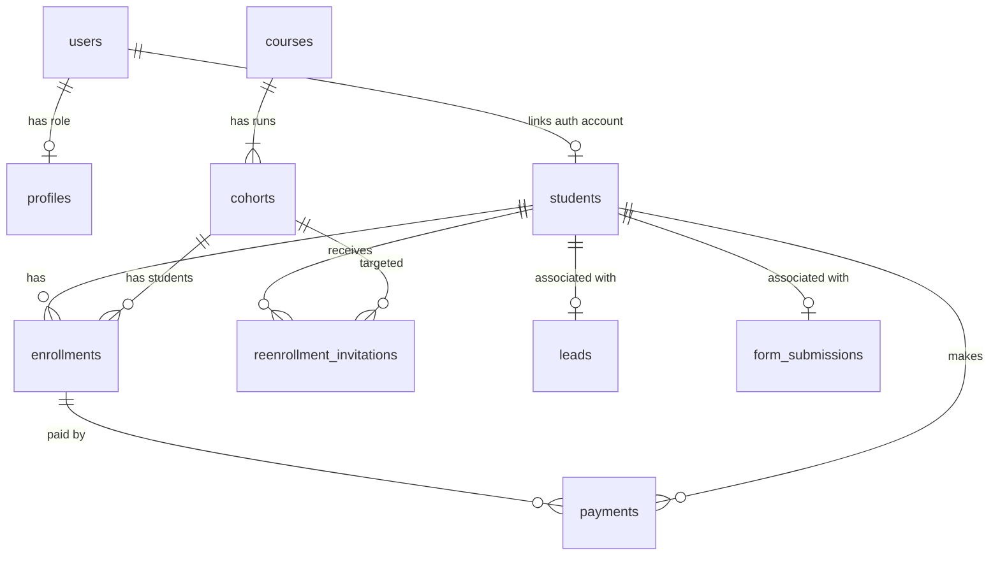
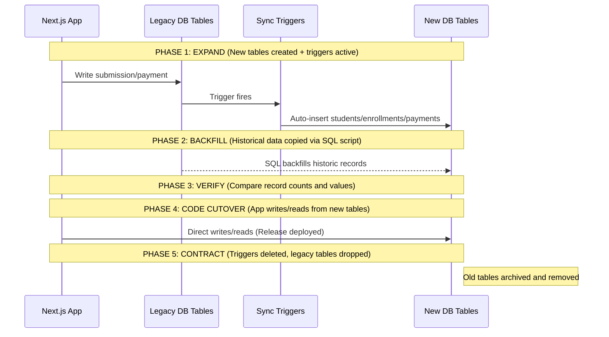

# Modernized Database Schema & 0-Downtime Migration Plan

This plan outlines the normalization of the current database schema to support future scalability, including student logins, rich course content, and structural robustness. It details a 0-downtime migration strategy using the **Expand-Contract (Parallel Run)** pattern.

---

## User Review Required

Please review the following structural changes and design choices:

> [!IMPORTANT]
> **Splitting Cohorts into Courses & Cohorts:** Currently, `cohorts` are single entries that combine Course details (title, description, image) and batch-specific details (month name, price, telegram chat ID). We propose separating these into two tables: `courses` (content template) and `cohorts` (specific run/batch of a course). This avoids duplicate title/description inputs when running the same course in multiple months.

> [!NOTE]
> **Keeping Leads and Generic Form Submissions:** Per your clarification, `leads` remains the dedicated table for capturing inquiries related to classes, collaborations, and performances. `form_submissions` will be kept as a generic table to capture any custom form submissions in the future (e.g., feedback forms, workshop registrations). Paid cohort enrollments and payment histories will be fully isolated into the new relational tables (`students`, `enrollments`, and `payments`).

---

## Open Questions

> [!NOTE]
> All open design questions have been resolved:
> 1. **Auth Integration (Resolved)**: When a student purchases a cohort/course, we will **automatically provision** a Supabase Auth user account (`auth.users`) for them using the Supabase Service Role client (`admin.inviteUserByEmail`). This generates an auth record, triggers a signup invitation to their email to set up a password, and returns their `auth_user_id` to link directly to their `students` row. This ensures every buyer has a secure, authenticated account immediately.
> 2. **Razorpay Sync**: We will update the `student_search_view` to merge new tables dynamically, ensuring any external read systems querying unified student lists remain fully operational during and after migration.

---

## Proposed Schema Design

The diagram below represents the proposed normalized schema:



### 1. New Tables SQL Definition

Here is the proposed SQL for the ideal schema. It is written defensively to run alongside existing tables:

```sql
-- ─────────────────────────────────────────────────────────────────────────────
-- 1. COURSES TABLE
-- ─────────────────────────────────────────────────────────────────────────────
CREATE TABLE IF NOT EXISTS public.courses (
    id UUID DEFAULT gen_random_uuid() PRIMARY KEY,
    title TEXT NOT NULL,
    description TEXT,
    image_url TEXT,
    status TEXT DEFAULT 'draft' CHECK (status IN ('draft', 'published', 'archived')),
    created_at TIMESTAMPTZ DEFAULT NOW(),
    updated_at TIMESTAMPTZ DEFAULT NOW()
);

-- ─────────────────────────────────────────────────────────────────────────────
-- 2. STUDENTS TABLE
-- ─────────────────────────────────────────────────────────────────────────────
-- Holds all student records. auth_user_id is nullable to support guest checkouts,
-- historic records, and webhook processing order.
CREATE TABLE IF NOT EXISTS public.students (
    id UUID DEFAULT gen_random_uuid() PRIMARY KEY,
    auth_user_id UUID UNIQUE REFERENCES auth.users(id) ON DELETE SET NULL,
    name TEXT NOT NULL,
    email TEXT UNIQUE NOT NULL,
    phone TEXT,
    created_at TIMESTAMPTZ DEFAULT NOW(),
    updated_at TIMESTAMPTZ DEFAULT NOW()
);
CREATE INDEX IF NOT EXISTS idx_students_email ON public.students(email);

-- ─────────────────────────────────────────────────────────────────────────────
-- 3. COHORTS (Normalized)
-- ─────────────────────────────────────────────────────────────────────────────
-- Temporarily, we keep public.cohorts as is, but we will add course_id.
-- For a clean slate, the ideal schema has:
-- course_id UUID NOT NULL REFERENCES public.courses(id)

-- ─────────────────────────────────────────────────────────────────────────────
-- 4. ENROLLMENTS TABLE
-- ─────────────────────────────────────────────────────────────────────────────
CREATE TABLE IF NOT EXISTS public.enrollments (
    id UUID DEFAULT gen_random_uuid() PRIMARY KEY,
    student_id UUID NOT NULL REFERENCES public.students(id) ON DELETE CASCADE,
    cohort_id UUID NOT NULL REFERENCES public.cohorts(id) ON DELETE RESTRICT,
    status TEXT DEFAULT 'active' CHECK (status IN ('active', 'completed', 'cancelled', 'suspended')),
    telegram_joined BOOLEAN DEFAULT false,
    telegram_username TEXT,
    telegram_invite_link TEXT,
    is_verified BOOLEAN DEFAULT false,
    created_at TIMESTAMPTZ DEFAULT NOW(),
    updated_at TIMESTAMPTZ DEFAULT NOW(),
    UNIQUE(student_id, cohort_id)
);
CREATE INDEX IF NOT EXISTS idx_enrollments_student ON public.enrollments(student_id);
CREATE INDEX IF NOT EXISTS idx_enrollments_cohort ON public.enrollments(cohort_id);

-- ─────────────────────────────────────────────────────────────────────────────
-- 5. PAYMENTS TABLE
-- ─────────────────────────────────────────────────────────────────────────────
CREATE TABLE IF NOT EXISTS public.payments (
    id UUID DEFAULT gen_random_uuid() PRIMARY KEY,
    student_id UUID REFERENCES public.students(id) ON DELETE SET NULL,
    enrollment_id UUID REFERENCES public.enrollments(id) ON DELETE SET NULL,
    razorpay_order_id TEXT UNIQUE,
    razorpay_payment_id TEXT UNIQUE,
    razorpay_payment_link_id TEXT UNIQUE,
    razorpay_subscription_id TEXT UNIQUE,
    razorpay_customer_id TEXT,
    amount INTEGER, -- in paise
    status TEXT DEFAULT 'pending' CHECK (status IN ('pending', 'paid', 'failed', 'refunded')),
    created_at TIMESTAMPTZ DEFAULT NOW(),
    updated_at TIMESTAMPTZ DEFAULT NOW()
);
CREATE INDEX IF NOT EXISTS idx_payments_order ON public.payments(razorpay_order_id);
CREATE INDEX IF NOT EXISTS idx_payments_payment ON public.payments(razorpay_payment_id);

-- ─────────────────────────────────────────────────────────────────────────────
-- 6. REENROLLMENT INVITATIONS TABLE
-- ─────────────────────────────────────────────────────────────────────────────
CREATE TABLE IF NOT EXISTS public.reenrollment_invitations (
    id UUID DEFAULT gen_random_uuid() PRIMARY KEY,
    student_id UUID NOT NULL REFERENCES public.students(id) ON DELETE CASCADE,
    source_cohort_id UUID REFERENCES public.cohorts(id) ON DELETE SET NULL,
    target_cohort_id UUID NOT NULL REFERENCES public.cohorts(id) ON DELETE CASCADE,
    payment_link_id TEXT,
    payment_link_url TEXT,
    status TEXT DEFAULT 'pending' CHECK (status IN ('pending', 'sent', 'failed', 'paid')),
    error_message TEXT,
    created_at TIMESTAMPTZ DEFAULT NOW(),
    updated_at TIMESTAMPTZ DEFAULT NOW()
);
```

### 2. Future Extensions (Student Login & Course LMS Content)

When you're ready to add actual course content to the site:
```sql
CREATE TABLE IF NOT EXISTS public.course_modules (
    id UUID DEFAULT gen_random_uuid() PRIMARY KEY,
    course_id UUID NOT NULL REFERENCES public.courses(id) ON DELETE CASCADE,
    title TEXT NOT NULL,
    description TEXT,
    order_index INTEGER DEFAULT 0,
    created_at TIMESTAMPTZ DEFAULT NOW()
);

CREATE TABLE IF NOT EXISTS public.course_lessons (
    id UUID DEFAULT gen_random_uuid() PRIMARY KEY,
    module_id UUID NOT NULL REFERENCES public.course_modules(id) ON DELETE CASCADE,
    title TEXT NOT NULL,
    description TEXT,
    video_url TEXT, -- Secure URL (Vimeo, YouTube, Cloudinary)
    video_duration INTEGER, -- in seconds
    is_free_preview BOOLEAN DEFAULT false,
    order_index INTEGER DEFAULT 0,
    created_at TIMESTAMPTZ DEFAULT NOW()
);
```
Checking access will be a simple query checking for an active enrollment:
```sql
-- Security Definer function to check access to lessons
CREATE OR REPLACE FUNCTION check_lesson_access(user_id UUID, lesson_id UUID)
RETURNS BOOLEAN AS $$
DECLARE
    has_access BOOLEAN;
BEGIN
    SELECT EXISTS (
        SELECT 1 
        FROM public.course_lessons cl
        JOIN public.course_modules cm ON cl.module_id = cm.id
        JOIN public.enrollments e ON e.cohort_id IN (
            SELECT id FROM public.cohorts WHERE course_id = cm.course_id
        )
        JOIN public.students s ON e.student_id = s.id
        WHERE cl.id = lesson_id 
          AND s.auth_user_id = user_id
          AND e.status = 'active'
    ) OR EXISTS (
        -- Admins and editors bypass access checks
        SELECT 1 FROM public.profiles 
        WHERE id = user_id AND (role = 'admin' OR role = 'editor')
    ) OR (
        -- Free preview lessons
        SELECT is_free_preview FROM public.course_lessons WHERE id = lesson_id
    ) INTO has_access;
    
    RETURN has_access;
END;
$$ LANGUAGE plpgsql SECURITY DEFINER;
```

---

## 0-Downtime Migration Strategy

We will use the **Expand-Contract** pattern to perform this migration with zero downtime.



### Phase 1: Expand (Infrastructure and Syncing)
1. **Create the New Schema Tables**: Create `courses`, `students`, `enrollments`, `payments`, and `reenrollment_invitations`.
2. **Backfill Courses**:
   Since existing cohorts contain course info, create distinct course records from them:
   ```sql
   INSERT INTO public.courses (title, description, image_url, status)
   SELECT DISTINCT ON (title) title, description, image_url, 'published'
   FROM public.cohorts
   ON CONFLICT DO NOTHING;
   ```
   Add the nullable `course_id` column to `cohorts` and link them:
   ```sql
   ALTER TABLE public.cohorts ADD COLUMN IF NOT EXISTS course_id UUID REFERENCES public.courses(id);
   
   UPDATE public.cohorts c
   SET course_id = co.id
   FROM public.courses co
   WHERE c.title = co.title AND c.course_id IS NULL;
   ```
3. **Deploy Database Sync Trigger for Cohort Registrations**:
   Create a trigger that synchronizes cohort registrations and payment writes from the old `form_submissions` table to the new `students`, `enrollments`, and `payments` tables. It ignores generic submissions (like feedback or surveys) by checking if `cohort_id` is present. This ensures that any cohort enrollments happening during the deploy transition window are captured.

   ```sql
   CREATE OR REPLACE FUNCTION sync_legacy_cohort_submissions_to_new()
   RETURNS TRIGGER AS $$
   DECLARE
       v_student_id UUID;
       v_enrollment_id UUID;
   BEGIN
       -- Only sync if it's a cohort registration (cohort_id is present)
       IF NEW.cohort_id IS NULL THEN
           RETURN NEW;
       END IF;

       -- 1. Sync Student (Upsert by email)
       IF NEW.user_email IS NOT NULL THEN
           INSERT INTO public.students (name, email, phone)
           VALUES (
               COALESCE(NEW.user_name, 'Anonymous'),
               NEW.user_email,
               COALESCE(NEW.form_data->>'phone', '')
           )
           ON CONFLICT (email) 
           DO UPDATE SET 
               name = EXCLUDED.name,
               phone = CASE WHEN COALESCE(EXCLUDED.phone, '') <> '' THEN EXCLUDED.phone ELSE students.phone END
           RETURNING id INTO v_student_id;
       END IF;

       -- 2. Sync Enrollment
       IF v_student_id IS NOT NULL THEN
           INSERT INTO public.enrollments (
               student_id, 
               cohort_id, 
               status, 
               telegram_joined, 
               telegram_username, 
               telegram_invite_link, 
               is_verified,
               created_at,
               updated_at
           )
           VALUES (
               v_student_id,
               NEW.cohort_id,
               CASE WHEN NEW.payment_status = 'paid' THEN 'active'::text ELSE 'cancelled'::text END,
               COALESCE(NEW.telegram_joined, false),
               NEW.telegram_username,
               NEW.telegram_invite_link,
               COALESCE(NEW.is_verified, false),
               NEW.created_at,
               COALESCE(NEW.updated_at, NEW.created_at)
           )
           ON CONFLICT (student_id, cohort_id)
           DO UPDATE SET
               status = EXCLUDED.status,
               telegram_joined = EXCLUDED.telegram_joined,
               telegram_username = EXCLUDED.telegram_username,
               telegram_invite_link = EXCLUDED.telegram_invite_link,
               is_verified = EXCLUDED.is_verified,
               updated_at = NOW()
           RETURNING id INTO v_enrollment_id;
       END IF;

       -- 3. Sync Payment (If payment data exists)
       IF v_student_id IS NOT NULL AND (NEW.razorpay_payment_id IS NOT NULL OR NEW.razorpay_order_id IS NOT NULL) THEN
           INSERT INTO public.payments (
               student_id,
               enrollment_id,
               razorpay_order_id,
               razorpay_payment_id,
               razorpay_payment_link_id,
               razorpay_subscription_id,
               razorpay_customer_id,
               amount,
               status,
               created_at
           )
           VALUES (
               v_student_id,
               v_enrollment_id,
               NEW.razorpay_order_id,
               NEW.razorpay_payment_id,
               NEW.razorpay_payment_link_id,
               NEW.razorpay_subscription_id,
               NEW.razorpay_customer_id,
               NEW.razorpay_amount,
               CASE WHEN NEW.payment_status = 'paid' THEN 'paid'::text ELSE 'pending'::text END,
               NEW.created_at
           )
           ON CONFLICT (razorpay_order_id) DO UPDATE SET
               razorpay_payment_id = EXCLUDED.razorpay_payment_id,
               status = EXCLUDED.status,
               amount = EXCLUDED.amount,
               updated_at = NOW();
       END IF;

       RETURN NEW;
   END;
   $$ LANGUAGE plpgsql;

   CREATE TRIGGER trigger_sync_legacy_cohort_submissions
   AFTER INSERT OR UPDATE ON public.form_submissions
   FOR EACH ROW EXECUTE FUNCTION sync_legacy_cohort_submissions_to_new();
   ```

### Phase 2: Backfill (Historical Data Migration)
Since new triggers only execute for new updates, run an SQL backfill for existing cohort records in `form_submissions` and invitations in `reenrollment_logs`:

```sql
-- 1. Backfill all student profiles from existing cohort registrations (where user_email is present)
INSERT INTO public.students (name, email, phone, created_at)
SELECT DISTINCT ON (user_email) user_name AS name, user_email AS email, COALESCE(form_data->>'phone', '') AS phone, created_at 
FROM public.form_submissions 
WHERE user_email IS NOT NULL AND cohort_id IS NOT NULL
ON CONFLICT (email) DO NOTHING;

-- 2. Backfill enrollments for existing cohort registrations
INSERT INTO public.enrollments (student_id, cohort_id, status, telegram_joined, telegram_username, telegram_invite_link, is_verified, created_at)
SELECT 
    s.id AS student_id,
    fs.cohort_id,
    CASE WHEN fs.payment_status = 'paid' THEN 'active'::text ELSE 'cancelled'::text END,
    COALESCE(fs.telegram_joined, false),
    fs.telegram_username,
    fs.telegram_invite_link,
    COALESCE(fs.is_verified, false),
    fs.created_at
FROM public.form_submissions fs
JOIN public.students s ON fs.user_email = s.email
WHERE fs.cohort_id IS NOT NULL
ON CONFLICT (student_id, cohort_id) DO NOTHING;

-- 3. Backfill payments linked to those enrollments
INSERT INTO public.payments (student_id, enrollment_id, razorpay_order_id, razorpay_payment_id, razorpay_payment_link_id, razorpay_subscription_id, razorpay_customer_id, amount, status, created_at)
SELECT 
    s.id AS student_id,
    e.id AS enrollment_id,
    fs.razorpay_order_id,
    fs.razorpay_payment_id,
    fs.razorpay_payment_link_id,
    fs.razorpay_subscription_id,
    fs.razorpay_customer_id,
    fs.razorpay_amount,
    CASE WHEN fs.payment_status = 'paid' THEN 'paid'::text ELSE 'pending'::text END,
    fs.created_at
FROM public.form_submissions fs
JOIN public.students s ON fs.user_email = s.email
LEFT JOIN public.enrollments e ON e.student_id = s.id AND e.cohort_id = fs.cohort_id
WHERE fs.cohort_id IS NOT NULL AND (fs.razorpay_order_id IS NOT NULL OR fs.razorpay_payment_id IS NOT NULL)
ON CONFLICT (razorpay_order_id) DO NOTHING;

-- 4. Backfill reenrollment invitations from reenrollment_logs
-- First, ensure all invited students are in the student table
INSERT INTO public.students (name, email, phone, created_at)
SELECT DISTINCT ON (student_email) student_name, student_email, student_phone, created_at
FROM public.reenrollment_logs
ON CONFLICT (email) DO NOTHING;

INSERT INTO public.reenrollment_invitations (student_id, source_cohort_id, target_cohort_id, payment_link_id, payment_link_url, status, error_message, created_at)
SELECT 
    s.id AS student_id,
    rl.source_cohort_id,
    rl.target_cohort_id,
    rl.payment_link_id,
    rl.payment_link_url,
    rl.status,
    rl.error_message,
    rl.created_at
FROM public.reenrollment_logs rl
JOIN public.students s ON rl.student_email = s.email;
```

### Phase 3: Verification
Verify data integrity by comparing table counts:
```sql
-- Compare paid registrations in legacy vs active enrollments
SELECT COUNT(*) FROM public.form_submissions WHERE cohort_id IS NOT NULL AND payment_status = 'paid';
SELECT COUNT(*) FROM public.enrollments WHERE status = 'active';

-- Verify payments record counts match cohort payments in legacy
SELECT COUNT(*) FROM public.form_submissions WHERE cohort_id IS NOT NULL AND (razorpay_order_id IS NOT NULL OR razorpay_payment_id IS NOT NULL);
SELECT COUNT(*) FROM public.payments;
```

### Phase 4: Code Cutover
Once verification passes:
1. Update API routes (`app/api/webhooks/razorpay/route.ts` and `app/api/send-email/route.ts`):
   - When a cohort enrollment checkout or payment succeeds, check if a student record exists in `students` for the email.
   - If no student or auth record exists, execute the Supabase Admin Auth API call: `await supabaseAdmin.auth.admin.inviteUserByEmail(email, { data: { name: studentName } })`. This sends a registration invite email and returns a user object.
   - Upsert the student profile, mapping their `auth_user_id` to the returned `auth.users.id`.
   - Write the enrollment record in `enrollments` and payment logs in `payments` directly.
   - Update welcome notification messaging to guide them through password setup using the invitation email.
2. Update the `student_search_view` view definition:
   ```sql
   CREATE OR REPLACE VIEW public.student_search_view 
   WITH (security_invoker = on) AS
   SELECT 
       e.id,
       s.name,
       s.email,
       COALESCE(s.phone, '') AS phone,
       c.title AS cohort_title,
       'enrollment'::text AS type,
       CASE WHEN e.status = 'active' THEN 'paid'::text ELSE 'pending'::text END AS status,
       e.created_at,
       e.telegram_invite_link AS payment_link_url,
       e.telegram_joined,
       e.telegram_username
   FROM 
       public.enrollments e
       JOIN public.students s ON e.student_id = s.id
       JOIN public.cohorts c ON e.cohort_id = c.id
   UNION ALL
   SELECT 
       ri.id,
       s.name,
       s.email,
       COALESCE(s.phone, '') AS phone,
       c.title AS cohort_title,
       'invitation'::text AS type,
       ri.status AS status,
       ri.created_at,
       ri.payment_link_url
   FROM 
       public.reenrollment_invitations ri
       JOIN public.students s ON ri.student_id = s.id
       JOIN public.cohorts c ON ri.target_cohort_id = c.id;
   ```
3. Update admin dashboard screens (`components/admin/CohortManager.tsx`, etc.) to interface with the new normalized tables.
4. Deploy the Next.js updates.

### Phase 5: Contract (Clean Up)
After a safety period (e.g. 1-2 weeks in production):
1. Drop the sync triggers:
   ```sql
   DROP TRIGGER IF EXISTS trigger_sync_legacy_cohort_submissions ON public.form_submissions;
   DROP FUNCTION IF EXISTS sync_legacy_cohort_submissions_to_new();
   ```
2. Delete the cohort columns and Razorpay payment columns from `form_submissions` to make it clean and strictly generic, or leave them as unused columns.
3. Drop `reenrollment_logs` since it is fully replaced by `reenrollment_invitations`.

---

## Verification Plan

### Automated Tests
- Create Vitest mock tests to verify that writing an enrollment correctly splits records into `students`, `enrollments`, and `payments` within Next.js API route code.
- Run typechecking to make sure Supabase Client API updates do not trigger compilation warnings:
  ```bash
  npm run type-check
  ```

### Manual Verification
- Deploy to a staging database environment (another Supabase project) and run the Expand triggers and backfill SQL scripts.
- Run the Verification queries to assert count congruence.
- Submit a mock payment payload to `/api/webhooks/razorpay` on staging, verifying the record splits cleanly and notifies correctly.
