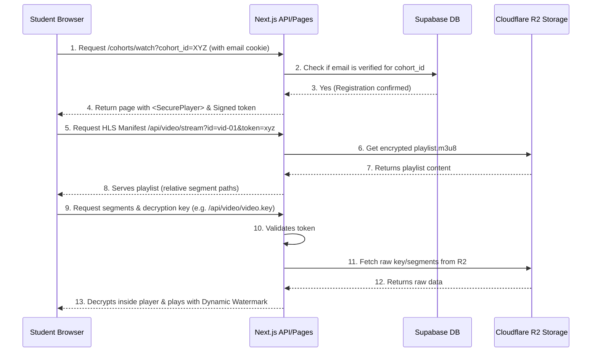

# Secure Video Course Hosting with Cloudflare R2

This plan outlines the architecture and step-by-step implementation for hosting online course videos securely on your website for **$0 bandwidth costs** using Cloudflare R2, Next.js, and Supabase.

By encrypting the video files with AES-128 and proxying all chunk/key requests through Next.js API endpoints, we ensure that files cannot be downloaded or shared without active, verified cohort registrations.

---

## Cloudflare Account & R2 Activation Requirement

To use this solution, you will need to sign up for a free Cloudflare account (if you don't have one) and enable R2 in your Cloudflare dashboard. While the first 10 GB of storage and all egress bandwidth are free, Cloudflare requires a credit card on file to activate R2 to prevent abuse.

---

## Technical Architecture & Flow

Before uploading course videos to Cloudflare R2, you must run a script to slice and encrypt the video files into HLS format. We will provide a helper script (`scripts/encrypt-video.js`) using `ffmpeg` to automate this local preparation.



---

## Proposed Implementation Steps

### 1. Database Configuration
Create a table to map videos to specific cohorts and store their R2 directory paths.
Run this migration in your Supabase SQL editor:
```sql
-- Create cohort_videos table
CREATE TABLE IF NOT EXISTS public.cohort_videos (
    id UUID DEFAULT gen_random_uuid() PRIMARY KEY,
    cohort_id UUID REFERENCES public.cohorts(id) ON DELETE CASCADE,
    title TEXT NOT NULL,
    r2_folder TEXT NOT NULL, -- e.g. "classes/june-2026/class-01"
    order_index INTEGER DEFAULT 0,
    is_published BOOLEAN DEFAULT false,
    created_at TIMESTAMPTZ DEFAULT NOW()
);

-- Enable RLS
ALTER TABLE public.cohort_videos ENABLE ROW LEVEL SECURITY;

-- Policies: Authenticated users (admin) can do anything. Public read restricted.
CREATE POLICY "Allow authenticated users to manage videos" ON public.cohort_videos
    FOR ALL TO authenticated USING (true) WITH CHECK (true);
```

### 2. Environment Setup
Add the following to your `.env.local` file:
```env
# Cloudflare R2 Credentials
R2_ACCESS_KEY_ID="your-r2-access-key-id"
R2_SECRET_ACCESS_KEY="your-r2-secret-access-key"
R2_ENDPOINT="https://<your-account-id>.r2.cloudflarestorage.com"
R2_BUCKET_NAME="course-content"
VIDEO_JWT_SECRET="generate-a-secure-random-jwt-secret-key"
```

### 3. Backend S3 Client (`lib/r2.ts`)
Create a file to manage connection with R2 (requires `@aws-sdk/client-s3` dependency):
```typescript
import { S3Client } from '@aws-sdk/client-s3';

export const r2Client = new S3Client({
  region: 'auto',
  endpoint: process.env.R2_ENDPOINT,
  credentials: {
    accessKeyId: process.env.R2_ACCESS_KEY_ID || '',
    secretAccessKey: process.env.R2_SECRET_ACCESS_KEY || '',
  },
});
```

### 4. OTP Request Endpoint (`app/api/auth/student/otp/route.ts`)
Creates a 6-digit OTP code, saves it to a short-lived table in Supabase, and emails it using your existing Resend integration.
- Validates that the input email matches an active paid registration in `form_submissions` (`payment_status = 'paid'` and `cohort_id` matches).

### 5. Verification Endpoint (`app/api/auth/student/verify/route.ts`)
Verifies the OTP code and signs a secure, HTTP-only cookie containing their email and authorized cohort access.

### 6. Streaming Proxy Route (`app/api/video/stream/route.ts`)
This API endpoint proxies all the HLS traffic, verifying the `student_auth` cookie first:
- When requesting `.m3u8`, retrieves the manifest from R2, replacing segment references with relative API endpoints.
- When requesting a `.ts` chunk, reads it from R2 and streams the binary content directly back to the client.
- When requesting `video.key`, retrieves the raw key from R2 and serves it directly.

### 7. Custom React HLS Player with Watermarking (`components/video/SecureVideoPlayer.tsx`)
```tsx
'use client'

import { useEffect, useRef, useState } from 'react'
import Hls from 'hls.js'

interface PlayerProps {
  playlistUrl: string; // Dynamic path, e.g. /api/video/stream?id=class-01
  studentEmail: string; // Active student email
}

export default function SecureVideoPlayer({ playlistUrl, studentEmail }: PlayerProps) {
  const videoRef = useRef<HTMLVideoElement>(null)
  const [watermarkPos, setWatermarkPos] = useState({ top: '30%', left: '30%' })

  useEffect(() => {
    let hls: Hls;
    if (videoRef.current) {
      const video = videoRef.current;
      if (Hls.isSupported()) {
        hls = new Hls({
          xhrSetup: (xhr) => {
            xhr.withCredentials = true; // Send auth cookies with every segment fetch
          }
        });
        hls.loadSource(playlistUrl);
        hls.attachMedia(video);
      } else if (video.canPlayType('application/vnd.apple.mpegurl')) {
        video.src = playlistUrl;
      }
    }
    return () => { hls?.destroy(); }
  }, [playlistUrl]);

  // Dynamic moving watermark to deter screen recordings
  useEffect(() => {
    const interval = setInterval(() => {
      setWatermarkPos({
        top: `${Math.floor(Math.random() * 70) + 10}%`,
        left: `${Math.floor(Math.random() * 70) + 10}%`
      });
    }, 10000);
    return () => clearInterval(interval);
  }, []);

  return (
    <div style={{ position: 'relative', width: '100%', overflow: 'hidden' }}>
      <video
        ref={videoRef}
        controls
        controlsList="nodownload"
        onContextMenu={(e) => e.preventDefault()}
        style={{ width: '100%', backgroundColor: '#000' }}
      />
      <div style={{
        position: 'absolute',
        top: watermarkPos.top,
        left: watermarkPos.left,
        pointerEvents: 'none',
        color: 'rgba(255, 255, 255, 0.12)',
        fontSize: '12px',
        fontWeight: 'bold',
        textShadow: '1px 1px 1px rgba(0,0,0,0.5)',
        transition: 'all 1.5s ease-in-out',
        userSelect: 'none',
      }}>
        {studentEmail}
      </div>
    </div>
  );
}
```

### 8. Local Video Processing Script (`scripts/encrypt-video.js`)
Install FFmpeg on your local machine and run this script to process your raw MP4 video files:
```javascript
const { execSync } = require('child_process');
const fs = require('fs');
const path = require('path');

// Usage: node encrypt-video.js <input.mp4> <output_dir> <video_id>
const [,, inputPath, outputDir, videoId] = process.argv;

if (!inputPath || !outputDir || !videoId) {
  console.log("Usage: node encrypt-video.js <input.mp4> <output_dir> <video_id>");
  process.exit(1);
}

fs.mkdirSync(outputDir, { recursive: true });

// 1. Generate a random 16-byte key
const keyPath = path.join(outputDir, 'video.key');
execSync(`openssl rand 16 > ${keyPath}`);

// 2. Create the keyinfo file for ffmpeg
const keyInfoPath = path.join(outputDir, 'key_info.txt');
const keyUrl = `/api/video/stream?id=${videoId}&file=video.key`;
fs.writeFileSync(keyInfoPath, `${keyUrl}\n${keyPath}\n`);

// 3. Segment and encrypt the video using ffmpeg
const playlistPath = path.join(outputDir, 'playlist.m3u8');
execSync(
  `ffmpeg -i ${inputPath} -c:v libx264 -c:a aac -hls_time 10 ` +
  `-hls_key_info_file ${keyInfoPath} -hls_playlist_type vod ${playlistPath}`
);

// Cleanup temporary key_info file
fs.unlinkSync(keyInfoPath);
console.log(`Video processing complete. Upload all contents of ${outputDir} to your R2 folder: classes/${videoId}/`);
```

---

## Verification Plan

1. **R2 Connection Validation:** Verify S3 Client initializes and successfully reads objects from the R2 private bucket.
2. **Key Access Control:** Attempt to download `/api/video/stream?id=vid-01&file=video.key` from an unauthenticated browser tab; verify it returns `401 Unauthorized`.
3. **Decryption Test:** Attempt to play the HLS `.ts` files inside a desktop player like VLC. They should fail to load without the `.key` file.
4. **Watermarking Test:** Verify the watermark moves position dynamically and overlays correctly across the playback.
